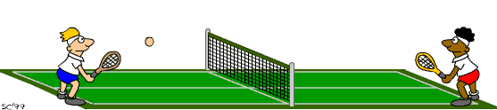
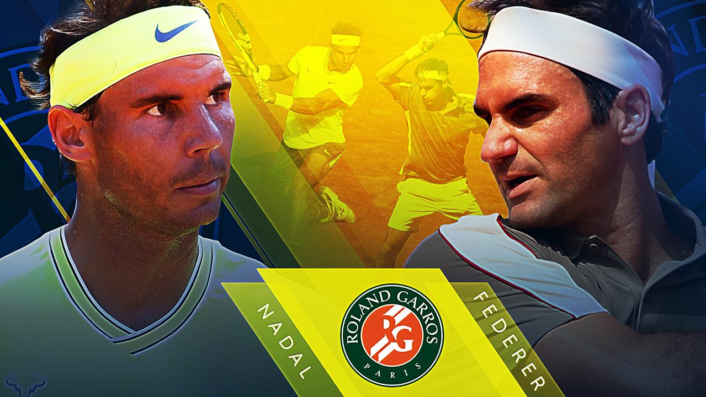

```{r setup, include=FALSE}
knitr::opts_chunk$set(warning = FALSE,message = FALSE,cache = F)
library(tidyverse)
library(here)
library(kableExtra)
library(scales)

```

```{r titleslide, child="components/titleslide.Rmd"}
```


---
# Motivation `r icon::fontawesome("lightbulb")`

- .monash-orange2[Main objective:] develop and evaluate different approaches for predicting the win/loss results of tennis matches at the professional level.
- .monash-orange2[Key goal:] account for the Head-To-Head effect
- .monash-orange2[Other features:]consider the variation of player's ability in the different surface courts


---
# Data description `r icon::fontawesome("database")`

- `atp_results` and `wta_results` are used in this report and the structure is shown as below:

```{r data-structure, echo=F,fig.cap="Key match informatiom"}
data <- data.frame(
  Variable = c("Surface","Player1","Player2","Tier"),
  Description = c("Match Surface","Match Winner","Match Loser","Professional tennis tour tournaments" ))

data %>%
  kable(caption = "Key match informatiom") %>%
  kable_styling(bootstrap_options = 
                c("striped", "condensed"), 
                full_width = F, 
                position = "center")
```

- However, the final model data is constructed by filtering the top 100 players from  from atpworldtour.com and wtatennis.com
  - develop a general framework more quickly by focusing on a relevant but smaller-scale problem.
  - Eg: total number of matches in **`atp`** : $36,000 \to 4,500$
  
---
# Head-To-Head `r icon::fontawesome("battle-net")`

- matchup effect of two specific players meeting in the matches. 
  - The player's ability in tennis
  - Other factor: the playing style, familiar with their opponents or psychological impact?
  


- The sample size of head-to-heads in professional tennis matches is small


```{r h2h-surface,echo=F,fig.cap="Matches with head to head effect on surface in ATP"}
atp_surface<-read_csv(here::here("data/atp_surface.csv"))

atp_surface%>%
	rename(`met=1`=`match=1`,
				 `met=2`=`match=2`,
				 `met>=3`=`match>=3`,
				 `per(met>=3)`=`per(match>=3)`)%>%
   kable(caption = "The number of matches on different surface in ATP") %>%
   kable_styling(bootstrap_options = c("striped", "border"),full_width = T,position = "center")%>%
   row_spec( 0,bold = T,color = "black",background = "white")%>%
  row_spec( 1:3,bold = T,color = "white",background = "#2875a1")
  
```

---
# Example `r icon::fontawesome("grin-beam")`
.cbox[
###### One of the famous example is: **`Federer–Nadal rivalry`**
]
<br>
```{r nadal-federer,echo=FALSE,fig.cap="Rafael Nadal VS Roger Federer",out.width="50%",out.height="40%",fig.align='center'}

```
<br>


```{r atp_match, echo=F}
atp_match<-read_csv(here("data/atp_match.csv"))
  
atp_match%>%
  filter(Player0=="Rafael Nadal"& Player1=="Roger Federer")%>%
  kable() %>%
   kable_styling(bootstrap_options = c("striped", "border"))%>%
   row_spec( 0,bold = T,color = "black",background = "white")%>%
  row_spec( 1,bold = T,color = "white",background = "#2875a1")
```

---
# Approach

The main approaches used in this project fell into two categories:
- Paired Comparison Model
  - Bradley-Terry Model
- Bayesian Paired Comparison Model
  - Head-To-Head effect model
  - Mixed effect Model with surface random effect
  
<br>  
  
.cbox[
###### Overall, the main model is the *`Bradley-Terry`* model.
]

---
# Bradley-Terry Model
- is one of the most popular paired comparison models
- is the probability model that can predict the outcome of a paired comparison. 
<center>
$\mathrm{P}(\left[ i \mbox{ beats } j \right]=\frac{\exp({\lambda_{i} )}}{\exp({\lambda_{i}})+\exp(\lambda_j)}$
<center>

<br>
- Alternative way using logit function: 
<center>
$logit(P(i>j))=log(\frac{P(i>j)}{1-P(i>j)})=\lambda_{i}-\lambda_{j}$
<center>
---
# Implementation `r icon::fontawesome("wrench")`

The main function for the BT model is `BTm` in `BradleyTerry2` package. 
<br>
```{r BT-model,echo=T,eval = F}
fit<-BTm(cbind(p0_count,p1_count),Player0,Player1,~Player,id="Player",data=atp_match)
```
- `BTabilities`: extract the abilities of each player  on the log scale against with the baseline player.

```{r Bt-ability,echo=T,eval = F}
BTabilities(fit)
```
- `prediction` function: obtain predicted probability from BT model

```{r bt-predict,echo=T,eval = F}
predict(fit,type="response")
# default predictions are of `log-odds` (probabilities on logit scale)
```

---
# Example (Nadal VS Federer) `r icon::fontawesome("grin-beam")`


- The estimated ability in the `ATP`
  - Baseline: Adrian Mannarino
<br>
<br>

<center>
```{r atp-ability,echo=FALSE,fig.width = 9,fig.height = 6,fig.cap="The estimated ability in each player"}
atp_abilities<-read_csv(here::here("data/atp_ability.csv"))
atp_bt_pred<-read_csv(here::here("data/atp_bt_pred.csv"))
atp_abilities%>%
	select(Player,Ability)%>%
	ggplot(aes(Ability))+
	geom_histogram(binwidth = 0.5)+
	geom_vline(xintercept = 2,color="red")+
	ggtitle("The estimated ability between each player")

```

---
# Example (Nadal VS Federer) `r icon::fontawesome("grin-beam")`

- The estimated ability between Nadal and Federer
<br>
<br>
```{r NF-ability,echo=F}
 atp_abilities%>%
   filter(Player=="Rafael Nadal"|Player=="Roger Federer")%>%
   mutate(Ability=round(Ability,digits = 4),
         SE=round(SE,digits = 4))%>%
   kable(caption="The estimated ability") %>%
    kable_styling(bootstrap_options = c("striped", "border"), full_width = T, 
                  position = "center")%>%
   row_spec( 0,bold = T,color = "black",background = "white")%>%
  row_spec( 1:2,bold = T,color = "white",background = "#2875a1")
```

<br>
- The prediction from standard Bradley-Terry model
<br>
<br>
```{r atp-bt-pred,echo=F,fig.cap="The comparison between predicted and actual probability about Nadal wins"}
atp_bt_pred<-read_csv(here::here("data/atp_bt_pred.csv"))

atp_bt_pred%>%
  filter(Player0=="Rafael Nadal"&Player1=="Roger Federer")%>%
  mutate(p0_pred=round(y_pred,digits = 4),
         p0_act=prob_p0)%>%
  select(-y_pred,-prob_p0)%>%
  kable(caption="The comparison between predicted and actual probability about Nadal wins") %>%
   kable_styling(bootstrap_options = c("striped", "border"),full_width = T, 
                  position = "center")%>%
   row_spec( 0,bold = T,color = "black",background = "white")%>%
  row_spec( 1,bold = T,color = "white",background = "#2875a1")
```


---
# Head-To-Head Model `r icon::fontawesome("star")`
- Further extension in Bradley-Terry model, cooperating with head-to-head effect.
<br>
<br>
$P(Win1)= \frac{\exp{(\lambda_1 - \lambda_0)}}{1 + \exp{(\lambda_1 - \lambda_1)}} \to \frac{\exp{(\lambda_1-\lambda_0+\delta_{1,0})}}{1+\exp{(\lambda_{1}-\lambda_{0}+\delta_{1,0})}}$

<newline>
where $\delta_{1,0}$ is the H2H effect between player 1 and player 0
<br>
<br>
- Implemented within Stan code model statement
  - `sampling` function in `rstan`package: computes posterior samples via MCMC(Markov Chain Monte Carlo) method.

---
# Example  (Nadal VS Federer) `r icon::fontawesome("grin-beam")`

- Head-To-Head effect between Nadal and Federer
<br>

```{r atp-h2h,echo=F,fig.cap="Nadal and Federer"}
atp_h2h<-read_csv(here::here("data/atp_h2h.csv"))
atp_h2h%>%
   filter(player0=="Rafael Nadal"&player1=="Roger Federer")%>%
  select(player0,player1,mean)%>%
  rename(h2h=mean)%>%
    mutate(h2h=round(h2h,digits=4))%>%
  kable() %>%
   kable_styling(bootstrap_options = c("striped", "border"),full_width = T, 
                  position = "center")%>%
   row_spec( 0,bold = T,color = "black",background = "white")%>%
  row_spec( 1,bold = T,color = "white",background = "#2875a1")
```

<br>
- Surprisingly, the prediction from Head-To-Head effect model is the same as actual value
  - It can capture more flexibility like head-to-head effect compared with standard Bradley-Terry model
<br>

```{r atp-stan-pred,echo=F,fig.cap="Rafael Nadal VS Roger Federer",fig.align='center'}
atp_stan_pred<-read_csv(here::here("data/atp_stan_pred.csv"))

atp_bt_pred%>%
  filter(Player0=="Rafael Nadal"&Player1=="Roger Federer")%>%
  mutate(p1_bt_prob=round(1-y_pred,digits = 4))%>%
  select(p1_bt_prob)->p1_bt_prob

atp_stan_pred%>%
   filter(player0=="Rafael Nadal"&player1=="Roger Federer")%>%
  cbind(p1_bt_prob)%>%
  rename(p1_h2h_prob=y_pred)%>%
  kable() %>%
   kable_styling(bootstrap_options = c("striped", "border"),full_width = T, 
                  position = "center")%>%
   row_spec( 0,bold = T,color = "black",background = "white")%>%
  row_spec( 1,bold = T,color = "white",background = "#2875a1")
```


---
# Mixed effect model

The extension of Bradley-Terry model with surface random effects can be simply represented as:

$\mathrm{Pr}\left[ i \mbox{ beats } j \right]=\frac{exp(\lambda_{i,s})}{exp(\lambda_{i,s})+exp(\lambda_{j,s})};$
$\lambda_{i,s}=\lambda_{i}+U_{i,s};$ 

$s$ represents different types of surface

<br>

- Implementation: **`bpc`** function in **`bpcs`** package

```{r echo=T,eval=F}
fit<-bpc(data = atp_surface,player0 = 'player0',player1 = 'player1',
    result_column = 'y',model_type = 'bt-U',cluster = 'Surface',iter = 3000)

```

---
# Example (Nadal VS Federer) `r icon::fontawesome("grin-beam")`

- The estimated ability of Nadal in the clay court is higher than Federer
  - One of explanation for the small matchup effect between them 
<br>

```{r NF-surface,echo=FALSE}
atp_sf<-read_csv(here::here("data/atp_sf.csv"))
atp_clay<-read_csv(here::here("data/atp_clay.csv"))

atp_clay%>%
  filter(Names=="Rafael Nadal")%>%
  rename(player0=Names)%>%
  select(-Ranking,Surface)%>%
  mutate(p0_mean=round(Mean,digits=2))%>%
  cbind(atp_clay%>%filter(Names=="Roger Federer")%>%
          rename(player1=Names)%>%
          select(-Ranking)%>%
          mutate(p1_mean=round(Mean,digits=2)))%>%
  select(player0,player1,p0_mean,p1_mean)%>%
  left_join(atp_sf%>%
    filter(Player0=="Rafael Nadal"&Player1=="Roger Federer"&Surface=="Clay"),by=c("player0"="Player0","player1"="Player1"))%>%
  rename(p0_count=y,
         total_count=n)%>%
  kable(caption = "Rafael Nadal VS Roger Federer") %>%
   kable_styling(bootstrap_options = c("striped", "border"))%>%
   row_spec( 0,bold = T,color = "black",background = "white")%>%
  row_spec( 1,bold = T,color = "white",background = "#2875a1")
```
<br>
<br>

`r icon::fontawesome("smile-wink")` Nadal has won 13 French Opens (the clay grand slam) and has a chance to win his 14th this week
---
# Conclusion: `r icon::fontawesome("hourglass-end")`

- The model performance comparison:
>Head-To-Head model
  >>Standard Bradley-Terry model
  >>>Mixed effect model

<br>
- Further exploration:
 - Expanding the data set
 - Combing the Surface Factor and Head-to-Head Models
 - Addition factors: player ranking, Elo scores,...


---
```{r endslide, child="components/endslide.Rmd"}
```

---
# Supplementary slides

---
# Model performace

- Calibration plot
<br>
	- Only the first and last bins deviated from 45 degree line, and the rest seemed to fit well.
	- Unstable situation for the extreme value
 
<center>
 
```{r echo=F,fig.height=5,fig.width=10}
atp_stan_cali<-read_csv(here("data/atp_stan_cali.csv"))
ggplot(atp_stan_cali,aes(mean_pred,mean_act))+
  geom_line()+
  geom_abline(slope = 1, intercept = 0, linetype = 2) +
  coord_cartesian(xlim = c(0, 1), ylim = c(0, 1)) +
  theme_bw()+
  xlab("Estimated probability")+ylab("Actual probability")+
  ggtitle("Calibration curve with H2H effect model in ATP")

```

---
# Baysian Paired Comparison Model
In order to capture the head-to-head effect in each pair of player, the bayesian inference is introduced in this case

$P(w|D)=\frac{P(D|w)P(w)}{P(D)} \propto P(D|w)P(w)$
<details  style="padding-left:40px;font-size:18pt">
<summary>Parameter details</summary>
<ul>
<li>\(D\) is a set of outcomes D but a single outcome will be given the notation r, </li>
<li>\(P(w|D)\) is the posterior probability, </li>
<li>\(P(D|w)\) is the likelihood of the model given the data,</li>
<li>\(P(w)\) is the prior probability,assumed in this case: \(w_{std} \sim N(0,1)\);\(w \sim N(0,w_{std}^2)\)</li>
<li>\(P(D)\) is marginal likelihood of the model found through normalisation.</li>
</ul>
</details>
<br>
Applying Bayesian method in Bradley Terry Model:

$P(r_{ij}=1|\lambda_{i},\lambda_{j})=\frac{exp(\lambda_{i})}{exp(\lambda_{i})+exp(\lambda_{j})}=\frac{1}{1+e^{-(\lambda_{i}-\lambda_{j})}}=\sigma(\lambda_{i}-\lambda_{j})$


<details  style="padding-left:40px;font-size:18pt">
<summary>Parameter details</summary>
<ul>
<li>\(r_{ij}=1\) indicates a win for player i against player j, </li>
<li>\(\lambda_{i};\lambda_{j}\) are the player skills which are the parameters of the model,</li>
<li>\(\sigma\) iis the logistic sigmoid function: \(\frac{1}{1+e^{-x}}\)</li>
</ul>
</details>

<br>
The likelihood function:
<center>
$P(D|w)=\prod_{i = 1}^{N} P(r^i|w)\to P(D|\lambda)=\prod_{i = 1}^{N} \sigma(\lambda_{a}^i-\lambda_{b}^i)$ 
<center>

given a set of match outcomes D and ability of each player $\lambda$
---
# Head-To-Head effect 

- In general, the next prediction outcome: $r^{n+1}_{ij}$ is take the expectation of $P(r^{n+1}_{ij}|\lambda_{i};\lambda_{j})$ with the posterior distribution $P(\lambda|D)$ and Using Bayesian inference to approximate the full posterior distribution.
- Implement in Stan with binomial distribution:
<center>
$$y \sim binomial(n,p)$$
$$P_{win_1}=\frac{\exp{(\lambda_1-\lambda_0+\delta_{1,0})}}{1+\exp{(\lambda_{1}-\lambda_{0}+\delta_{1,0})}}$$
$$y_{pred}\sim binomial(n,P_{win_1})$$ 
where $y$ is the number of matches of player1 wins
    

